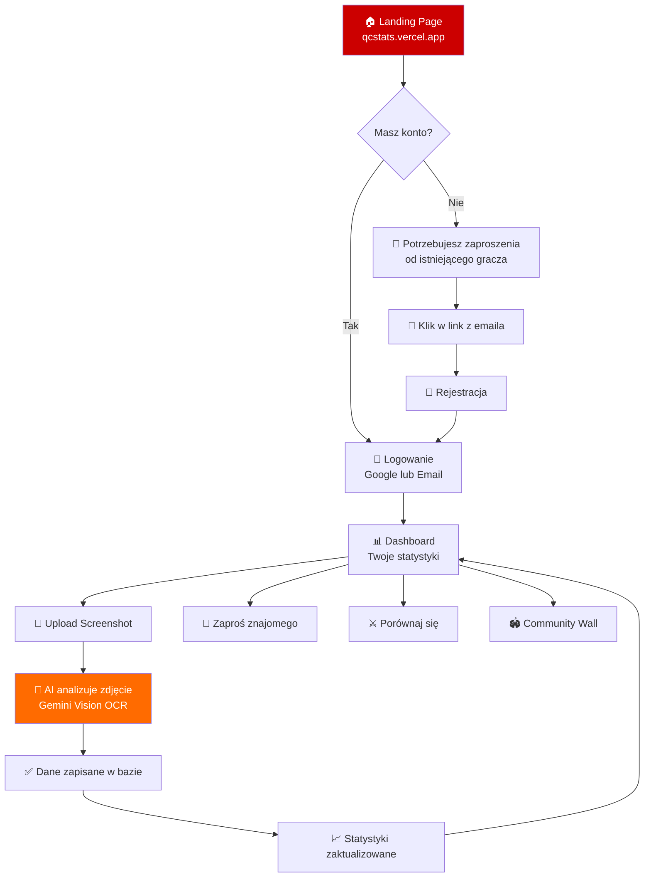
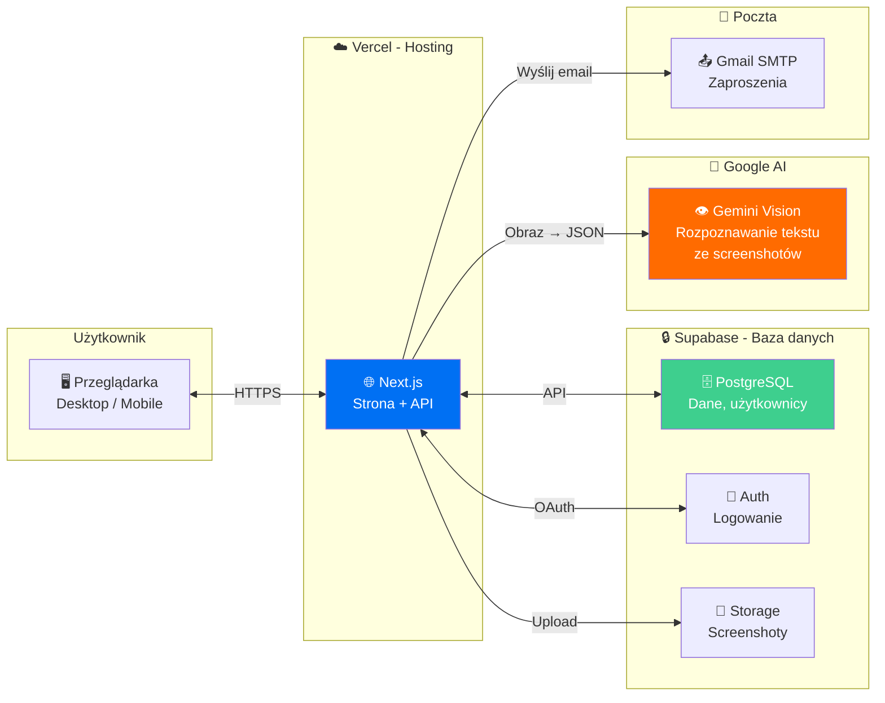
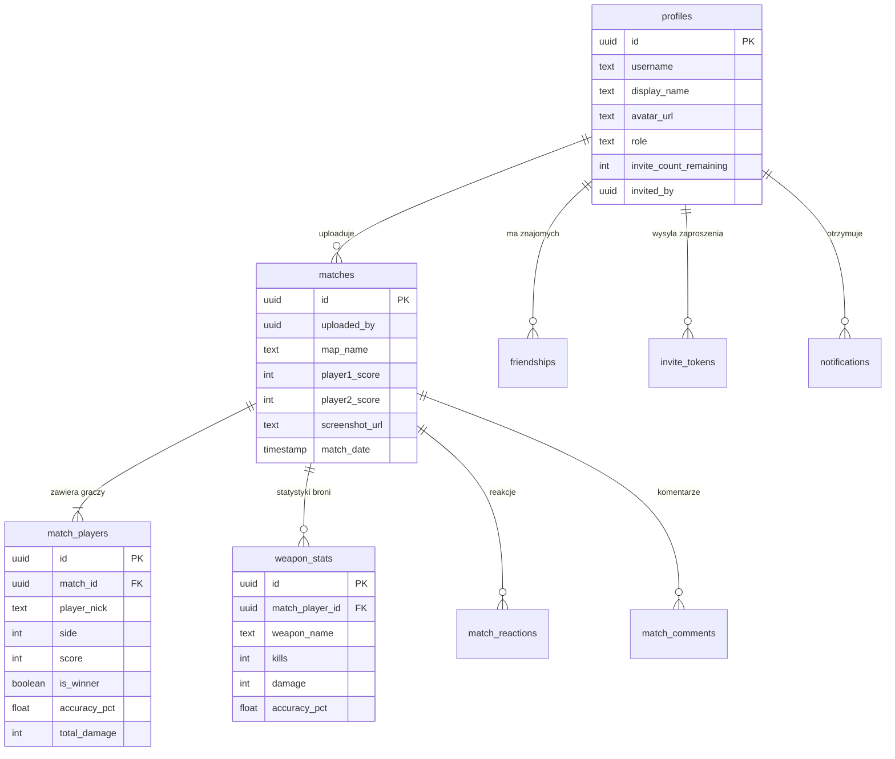
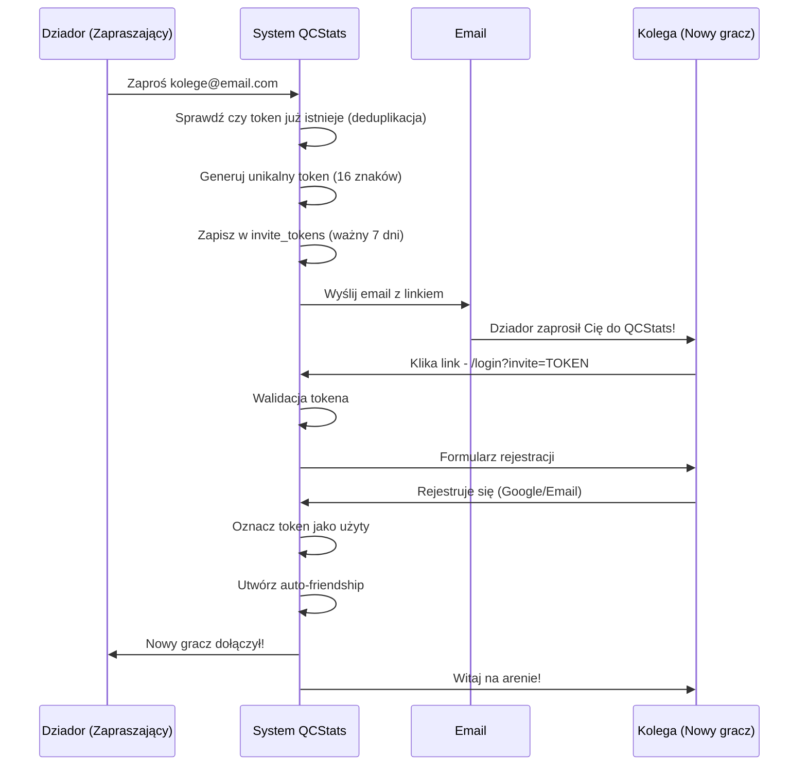
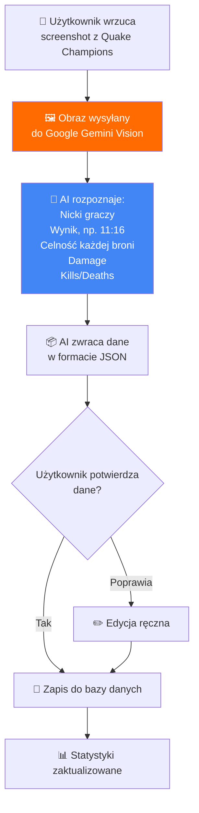
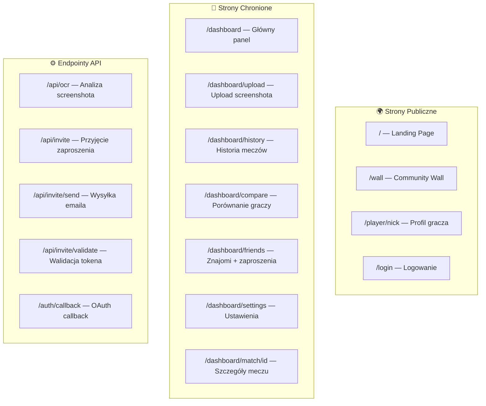

# QCStats — Dokumentacja Systemowa
### Wersja 1.0 | Kwiecień 2026

---

## 1. Czym jest QCStats?

QCStats to **platforma do automatycznego śledzenia statystyk** z gry Quake Champions (tryb Duel 1v1). Zamiast ręcznie zapisywać wyniki, gracz robi **screenshot ekranu wyników** po meczu, a system przy pomocy **sztucznej inteligencji** automatycznie odczytuje dane i gromadzi je w jednym miejscu.

### Kluczowe funkcje:
| Funkcja | Opis |
|---|---|
| 📸 **Upload screenshot** | Wrzuć zdjęcie wyników — AI zrobi resztę |
| 📊 **Dashboard** | Twoje statystyki: win rate, celność, damage |
| ⚔️ **Porównywanie** | Porównaj się z innymi graczami |
| 🏟️ **Community Wall** | Publiczna tablica najnowszych meczy |
| 👥 **System znajomych** | Zaproś kolegów, śledź ich postępy |
| 🔍 **Wyszukiwarka** | Znajdź dowolnego gracza po nicku |

### Aktualny stan platformy:
| Metryka | Wartość |
|---|---|
| Użytkownicy | 4 |
| Zapisane mecze | 12 |
| Rekordy broni | 264 |
| Znajomości | 3 |

---

## 2. Jak to działa? (Flow użytkownika)



### Ścieżka nowego użytkownika (krok po kroku):

1. **Otrzymujesz zaproszenie** — istniejący gracz wysyła Ci email z linkiem
2. **Klikasz link** → trafiasz na stronę rejestracji z informacją kto Cię zaprosił
3. **Rejestrujesz się** przez Google lub email+hasło
4. **Automatycznie** zostajesz znajomym osoby zapraszającej
5. **Wrzucasz screenshot** z Quake Champions
6. **AI rozpoznaje** wszystkie dane: wynik, celność, damage, kill/death, broń
7. **Widzisz swoje statystyki** na dashboardzie

---

## 3. Architektura systemu



### Co to znaczy w prostych słowach?

| Komponent | Co robi | Analogia |
|---|---|---|
| **Vercel** | Hostuje stronę, obsługuje żądania | Jak serwer w restauracji — przyjmuje zamówienia |
| **Next.js** | Framework strony (kod) | Jak przepis — jak strona ma wyglądać i działać |
| **Supabase** | Baza danych + logowanie + pliki | Jak sejf — przechowuje wszystkie dane |
| **Gemini Vision** | AI czytający screenshoty | Jak OCR ale inteligentny — rozumie tabelki z gry |
| **Gmail SMTP** | Wysyła emaile z zaproszeniami | Jak poczta — dostarcza wiadomości |

---

## 4. Baza danych — co przechowujemy



### Tabele w prostych słowach:

| Tabela | Ile kolumn | Co przechowuje |
|---|---|---|
| `profiles` | 15 | Konta użytkowników — nick, awatar, rola, ilość zaproszeń |
| `matches` | 13 | Mecze — mapa, wynik, screenshot, data |
| `match_players` | 18 | Gracze w meczu — nick, strona, wynik, celność, damage |
| `weapon_stats` | 8 | Statystyki per broń — kills, damage, celność |
| `friendships` | 5 | Relacje znajomych — kto z kim, status |
| `invite_tokens` | 8 | Tokeny zaproszeń — kto zaprosił, email, wygasa za 7 dni |
| `notifications` | 7 | Powiadomienia — nowy znajomy, itp. |
| `match_reactions` | 6 | Reakcje pod meczami (emoji) |
| `match_comments` | 5 | Komentarze pod meczami |
| `reports` | 7 | Zgłoszenia nadużyć |
| `match_groups` | 5 | Grupy meczów (serie) |
| `nickname_change_requests` | 9 | Prośby o zmianę nicku |

---

## 5. System zaproszeń

> [!IMPORTANT]
> QCStats to **zamknięta społeczność** — rejestracja jest możliwa wyłącznie na zaproszenie.



### Zasady:
- Każdy nowy użytkownik dostaje **25 zaproszeń**
- Admin (Dziador) ma **nieograniczone** zaproszenia
- Token wygasa po **7 dniach**
- Wielokrotne zaproszenie tego samego emaila → **system reużywa istniejący token** (nie tworzy duplikatów)
- Po rejestracji → automatyczne **friendship** z osobą zapraszającą

---

## 6. OCR — Jak AI czyta screenshoty



### Rozpoznawane bronie (11 typów):
| Ikona | Broń | Śledzone dane |
|---|---|---|
| ⚡ | Lightning Gun (LG) | Kills, Damage, Celność % |
| 🔫 | Railgun | Kills, Damage, Celność % |
| 🚀 | Rocket Launcher | Kills, Damage, Celność % |
| 💀 | Super Shotgun | Kills, Damage, Celność % |
| 🔥 | Super Nailgun | Kills, Damage, Celność % |
| ⭕ | Tri-bolt | Kills, Damage, Celność % |
| 💎 | Heavy Machine Gun | Kills, Damage, Celność % |
| 🩸 | Machine Gun | Kills, Damage, Celność % |
| 🔪 | Gauntlet | Kills, Damage, Celność % |
| 🎯 | Shotgun | Kills, Damage, Celność % |
| 🌀 | Nailgun | Kills, Damage, Celność % |

---

## 7. Zabezpieczenia

| Warstwa | Opis |
|---|---|
| 🔐 **Logowanie** | Google OAuth 2.0 lub email+hasło (Supabase Auth) |
| 🛡️ **RLS** | Row Level Security — każdy widzi tylko swoje dane |
| 🔒 **Middleware** | Automatyczny redirect na login dla chronionych stron |
| 🧹 **Sanityzacja** | Oczyszczanie danych wejściowych (anty-XSS) |
| 🔑 **Klucze API** | Gemini i Service Role key tylko po stronie serwera |
| 📧 **Invite-only** | Zamknięta rejestracja zapobiega spamowi |
| ⏰ **Token expiry** | Zaproszenia wygasają po 7 dniach |

### Chronione ścieżki (wymagają logowania):
```
/dashboard/*    — cały panel użytkownika
/profile/*      — profil użytkownika
/settings/*     — ustawienia
```

### Publiczne ścieżki (bez logowania):
```
/               — landing page
/wall           — community wall (publiczna)
/player/[nick]  — profil gracza (publiczny)
/login          — strona logowania
```

---

## 8. Infrastruktura i koszty

| Usługa | Plan | Koszt | Limity |
|---|---|---|---|
| **Vercel** | Hobby (Free) | 0 zł | 100 GB bandwidth/msc |
| **Supabase** | Free | 0 zł | 500 MB DB, 1 GB storage, 50k auth requests |
| **Gemini API** | Free tier | 0 zł | 15 req/min, 1500/dzień |
| **Gmail SMTP** | Google App Password | 0 zł | ok. 500 emaili/dzień |
| **Domena** | qcstats.vercel.app | 0 zł | Subdomena Vercel |

> [!NOTE]
> Cała platforma działa na **darmowych planach**. Przy wzroście powyżej ok. 50 użytkowników warto rozważyć Supabase Pro ($25/msc) dla lepszej wydajności bazy.

---

## 9. Mapa stron



---

## 10. Technologie — słowniczek

| Termin | Wyjaśnienie |
|---|---|
| **Next.js** | Framework (szkielet) do budowania stron internetowych. Działa zarówno po stronie serwera jak i przeglądarki. |
| **React** | Biblioteka do tworzenia interaktywnych interfejsów. Każdy element na stronie to "komponent". |
| **TypeScript** | Ulepszona wersja JavaScript z kontrolą typów — mniej błędów w kodzie. |
| **Supabase** | Usługa "backend-as-a-service" — baza danych, logowanie, storage w jednym. |
| **PostgreSQL** | Silnik bazy danych — przechowuje wszystkie dane. |
| **RLS** | Row Level Security — zasady kto może widzieć/edytować jakie dane. |
| **Vercel** | Platforma hostingowa — serwer na którym działa strona. |
| **OAuth** | Protokół logowania "przez Google" — nie musisz tworzyć hasła. |
| **API** | Interface programistyczny — sposób komunikacji między częściami systemu. |
| **OCR** | Optical Character Recognition — rozpoznawanie tekstu z obrazów. |
| **Gemini Vision** | Model AI od Google do analizy obrazów. |
| **SMTP** | Protokół wysyłania emaili. |
| **Middleware** | "Strażnik" — kod sprawdzający uwierzytelnienie przed wyświetleniem strony. |

---

## 11. Plan rozwoju

### Krótkoterminowy (następne tygodnie):
- [ ] Rate limiting na OCR (max 10 screenshotów/min/user)
- [ ] System punktacji zaufania (Trust Score)
- [ ] Weryfikacja krzyżowa meczów
- [ ] Odczytywanie mapy z screenshota

### Średnioterminowy (1-3 miesiące):
- [ ] Ranking globalny (ELO/Glicko)
- [ ] Wykresy trendów (jak zmienia się celność w czasie)
- [ ] Turnieje / bracket system
- [ ] Powiadomienia push

### Długoterminowy (wizja):
- [ ] Aplikacja mobilna
- [ ] Integracja z API Quake Champions (gdy/jeśli będzie dostępne)
- [ ] System osiągnięć (achievements)
- [ ] Własna domena (np. qcstats.gg)

---

*Dokument wygenerowany automatycznie na podstawie analizy kodu źródłowego i bazy danych QCStats.*
*Ostatnia aktualizacja: 14.04.2026*
